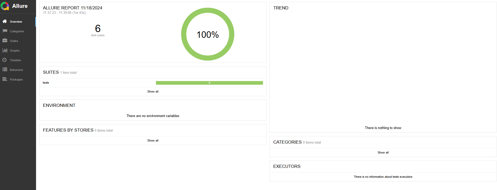
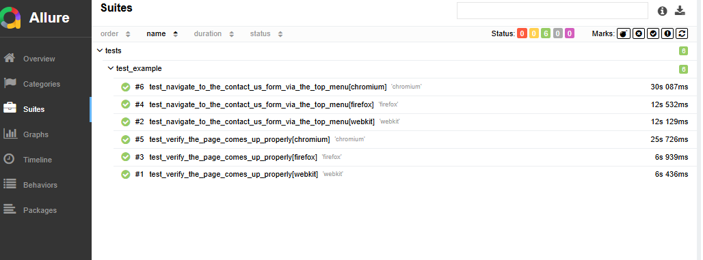

# playwright_task

1. create python virtual enviroment:  `python -m venv venv` or `python3 -m venv venv` depending on your machine. 

2. activate virtual enviroment: `source venv/bin/activate`
install pip: `sudo apt install python3-pip`

3. install dependencies: `pip install -r requirements.txt`

4. run the following to install playwright dependencies
- `playwright install`
- `playwright install-deps`

## using vscode devcontainers
See how to install here: https://code.visualstudio.com/docs/devcontainers/containers

once you are in your devcontainers you can follow steps above.

## running the test
`pytest tests/test_example.py --headed --slowmo 2000`

or multiple with html report

`pytest tests/test_example.py --headed --slowmo 2000 --browser webkit --browser firefox --browser chromium --alluredir allure-results`

## reporting

If you use the devcontainer provided in this project allure reports can be installed with `brew install allure` 

to view results run `allure serve allure-results`

